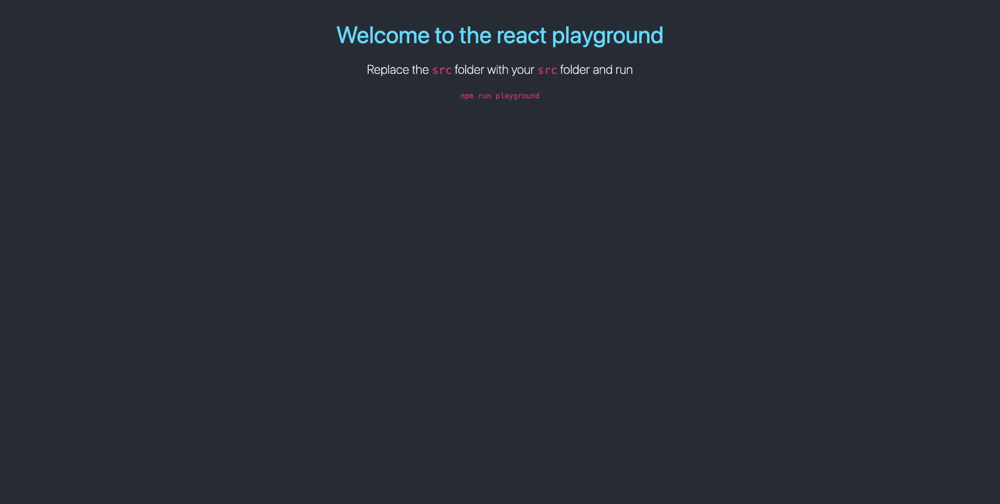

# React Training

## Getting Started

Navigate in to project workspace to clone this repository

```
git clone git@scm.server.traveljigsaw.com:tech-returners/react-training.git
cd react-training
```

---

Install the dependencies for the react playground and run the playground. Please note that `npm run init` is a custom script that installs all the dependencies required by React in the `playground` directory.

```
npm run init
npm run playground
```

You should see a webpage open in your default browser on http://localhost:3000/ like this



## Running the playground

- Replace the `/src` directory in the `/playground` folder with the `/src` directory from either the challenges or the concepts (depending on what you want to run in the playground)
- Open your terminal and make sure you are in the root directory of the react-training project (entry directory of this repository)
- Run the following command in the terminal `npm run playground` and you should see your React application open in http://localhost:3000/
- If you want to stop the playground, in the terminal press (CTRL + C)

## Course Curriculum

### Week 01

#### Day 01

- Introduction to React
- Adding React to an existing website
- DOM and React virtual DOM
- create-react-app script
- What is JSX
- Function-based components
- Using React Dev Tools

#### Day 02

- Props
- What is prop drilling
- Render many components via props
- Importance of key in rendering many
- Conditional render
- GitHub directory challenge

### Week 02

Coming Soon

## Recordings

- [Week 01 Day 01](https://booking.zoom.us/rec/share/JlbBPKOVBtM1oU-QqPzPQqeipOiUzinTmkxrKxQyaprqT8dgNGPTFTJUZWr85Rtc.zAKuqIsjmY7U4sGj) **Passcode: Z586me&C**
- [Week 01 Day 02](https://booking.zoom.us/rec/share/1Yi3nIbuka-Hi3Hhgb_9O2nTZGAiyHE-QFlZIaEw1vEbsTXA64Gf2wX7WYP87uuc.EmyYunlOs9ioX5Ej) **Passcode: Rs7pJn\*9**
